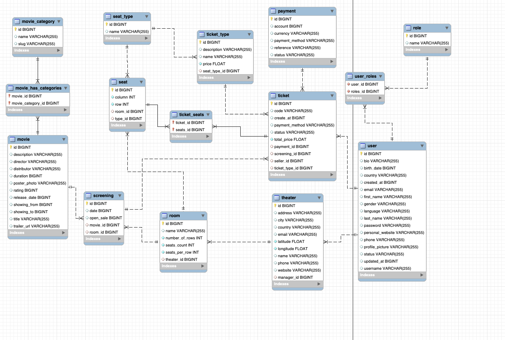

# Cinemo - Backend

](https://coveralls.io/github/PW-mates/cinemo-backend?branch=main)

### Introduction
The back-end repository contains the server-side code for Cinemo - web application that is used to manage the cinema chains.

The repository uses Spring Boot framework to handle all the necessary configurations, it provides a set of RESTful endpoints that the client side can consume, the application also handle authentication and authorization based on JSON Web Tokens.

### Getting Started
In order to run the application you need to have the following installed on your machine:
- Java 8
- Gradle 4.10.2
- MySQL 5.7

You also need to set environment variables for the following:
- `DATASOURCE_URL` - the URL of the database
- `DATASOURCE_USERNAME` - the username of the database
- `DATASOURCE_PASSWORD` - the password of the database
- `JWT_SECRET` - the secret key used for JWT

It can be set in file .env in the root of the project.

Once you have these dependencies set up, you can follow these steps to get the backend running:
```
gradle ./bootRun
```

### Architecture
The backend is built using Spring Boot, with the Spring Data JPA and Spring Security for handling the data access and security respectively. The application is divided into several layers, such as:
- Controllers - the controllers are responsible for handling the incoming requests and returning the appropriate responses
- Services - the services are responsible for handling the business logic of the application
- Repositories - the repositories are responsible for handling the data access to the database
- Entities - the entities are the models of the application
- DTOs - the DTOs are the models that are used to transfer data between the client and the server

### Endpoints
The full list of endpoints is available here: [here](https://github.com/PW-mates/cinemo-frontend/blob/main/src/configs/appConfig.ts)

### Database



### Testing

- The application is tested using JUnit and Mockito.
- The tests are divided into several categories:
    - Unit tests - tests the individual components of the application
    - Integration tests - tests the integration between the components of the application
    - End-to-end tests - tests the application as a whole

### Tools
- IntelliJ IDEA
- MySQL Workbench
- Postman
- Git
- GitHub

### Responsibilities
- Truong Giang Do
- Daria Komarynska
